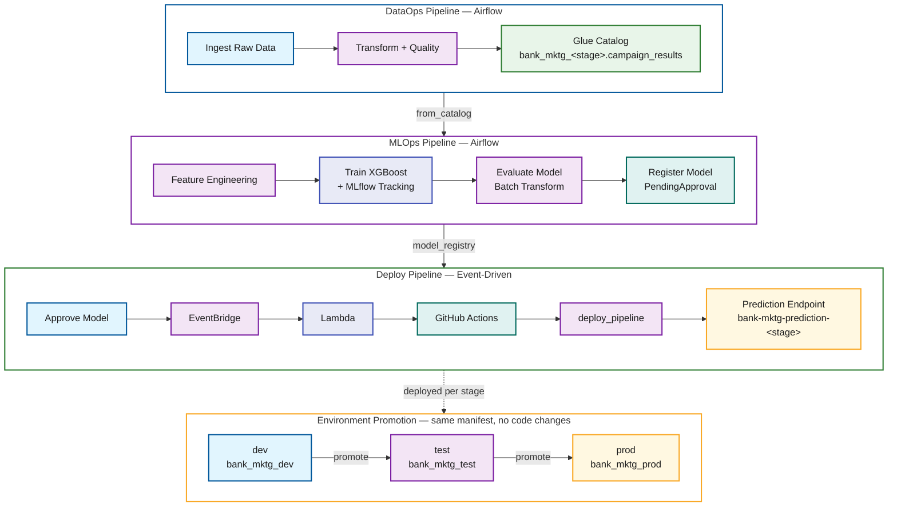

# Unified AI Operations: MLOps and DataOps with SMUS CLI

## Overview

> **Note:** This is a reference example. To run it, copy it into **your own GitHub repository and AWS account**, then configure the GitHub secrets/variables and OIDC role there (see [Deployment & Configuration](#deployment--configuration)). The workflows under `.github/workflows/` exist to exercise and demonstrate the deploy/promote pattern in this repo.

This example demonstrates deploying end-to-end data and ML pipelines to Amazon SageMaker Unified Studio using the [`aws-smus-cicd-cli`](https://github.com/aws/CICD-for-SageMakerUnifiedStudio). One manifest format. One CLI. One CI/CD pattern — whether you're ingesting raw data with Glue ETL or training an XGBoost model with SageMaker.

It includes three example pipelines that form a data lineage chain:

- **DataOps** — ingests, transforms, and validates bank marketing data using Glue and Athena
- **MLOps** — trains, evaluates, and registers an XGBoost binary classifier using SageMaker Airflow operators
- **Deploy** — deploys approved models to a real-time endpoint, triggered automatically on model approval

They all follow the same declarative workflow: define resources in YAML, deploy with one command, orchestrate on MWAA Serverless, and promote across environments (dev → test → prod) without code changes.

## Table of Contents

**Understand the system**

- [Architecture](#architecture)
- [Pipelines](#pipelines)
- [How the SMUS CLI Deploys](#how-the-smus-cli-deploys)

**Get set up**

- [Prerequisites](#prerequisites)
- [Quick Start](#quick-start)

**Deploy and promote**

- [Deployment & Configuration](#deployment--configuration)

**Reference**

- [CI/CD](#cicd)
- [Infrastructure](#infrastructure)
- [CLI Commands](#cli-commands)
- [Project Structure](#project-structure)

## Architecture

The system consists of three pipelines that form a data lineage chain with event-driven deployment:



The coupling points:

- **DataOps → MLOps:** Glue Data Catalog. DataOps writes to `bank_mktg_<stage>.campaign_results`, MLOps reads from it.
- **MLOps → Deploy:** SageMaker Model Registry. Training registers models as `PendingManualApproval`. Every approval triggers deployment via EventBridge → Lambda → GitHub Actions → deploy_pipeline DAG.

Stage-prefixed names (`bank_mktg_dev`, `bank-mktg-prediction-dev`) ensure complete namespace isolation across environments.

### Deploy trigger behavior

The EventBridge rule is intentionally permissive — it matches every `Model Package State Change` event where `ModelApprovalStatus=Approved`, and the Lambda decides whether to dispatch:

- **Every genuine approval triggers the pipeline exactly once**, whether the model is approved from the SageMaker console, the SMUS UI, or the API. The Lambda keys off `UpdatedModelPackageFields` (it dispatches when `ModelApprovalStatus` is among the changed fields), so it does not depend on `previousModelApprovalStatus`, which API- and UI-driven approvals omit.
- **No infinite loop.** After each deploy, the promote workflow stamps `CustomerMetadataProperties` on the model version, which re-emits an `Approved` event. Those re-emits change only `CustomerMetadataProperties`, so the Lambda skips them instead of kicking off another deploy.

## Pipelines

| Pipeline | Directory | Description |
| -------- | --------- | ----------- |
| **DataOps** | [`examples/dataops-pipeline/`](examples/dataops-pipeline/) | Glue ETL + Athena catalog registration |
| **MLOps Training** | [`examples/mlops-pipeline/`](examples/mlops-pipeline/) | Feature engineering, SageMaker training, evaluation, model registry |
| **Deploy (Event-Driven)** | [`examples/mlops-pipeline/workflows/deploy_pipeline.yaml`](examples/mlops-pipeline/workflows/deploy_pipeline.yaml) | EventBridge → Lambda → GitHub Actions → deploy_pipeline DAG → endpoint |

The MLOps pipeline depends on DataOps — run DataOps first to create the `campaign_results` table. Per-pipeline walkthroughs live in each sub-README (linked above).

## How the SMUS CLI Deploys


The SMUS CLI handles resource provisioning in dependency order, stage-specific configuration substitution, and the full deployment lifecycle. In CI, GitHub Actions drives these same commands — see [CI/CD](#cicd) for the OIDC and multi-stage setup.

## Prerequisites

| Tool | Version | Purpose |
| ---- | ------- | ------- |
| Python | 3.11+ | Runtime for CLI and Glue scripts |
| AWS CLI | v2 | AWS resource management |
| `aws-smus-cicd-cli` | latest | Pipeline deployment and orchestration |
| `jq` | any | JSON parsing for shell scripts |

You also need:

- An AWS account with permissions for SageMaker, Glue, Athena, S3, IAM, and MWAA
- A SageMaker Unified Studio domain and project with MWAA Serverless enabled
- Environment variables set for every stage the manifest defines

These are the same values configured as GitHub variables/secrets for CI (the source of truth — see [GitHub configuration](#github-configuration-ci-source-of-truth)). For local runs, export them for each stage your manifest defines. Account ID and domain are auto-resolved — do not export them; only `DEV_DOMAIN_REGION` is strictly required, and the rest have manifest defaults.

```bash
# DataOps (dev stage only):
export DEV_DOMAIN_REGION=<your-region>               # required
export DEV_PROJECT_NAME=<your-dev-project>           # optional (default: e2e-data-ml-ops-dev)
export DOMAIN_TAG_PURPOSE=<your-domain-purpose-tag>  # optional (default: smus-cicd-testing)

# MLOps also deploys test/prod, so additionally export (all optional, have defaults):
export TEST_DOMAIN_REGION=<your-region>
export TEST_PROJECT_NAME=<your-test-project>
export PROD_DOMAIN_REGION=<your-region>
export PROD_PROJECT_NAME=<your-prod-project>
export MLFLOW_TRACKING_SERVER_NAME=<your-mlflow-server-name>
```

## Quick Start

- **Minimal local run:** follow the [DataOps pipeline walkthrough](examples/dataops-pipeline/) (describe → deploy → run → monitor against `dev`).
- **Full CI-driven setup** and the dev → test → prod promotion: see [Deployment & Configuration](#deployment--configuration).

## Deployment & Configuration

End-to-end path from an empty repo to an automated dev → test → prod promotion. [One-time setup](#one-time-setup) (steps 1–4) prepares the repo and AWS account; the [deploy and promote flow](#deploy-and-promote-flow) (steps 5–9) is what you repeat for every model.

### One-time setup

#### 1. Install prerequisites and set environment variables

Install the CLI and export the stage variables listed in [Prerequisites](#prerequisites):

```bash
pip install aws-smus-cicd-cli
aws sts get-caller-identity        # confirm your AWS credentials/account
```

#### 2. Configure GitHub for CI/CD

All jobs run in a single GitHub Environment named `dev-aws-account`, which holds the OIDC role secret and region. Add them there:

```bash
REPO=<owner>/<repo>

# Single OIDC role secret, assumed directly by every job
gh secret set AWS_ROLE_ARN_DEV --repo "$REPO" --env dev-aws-account --body "arn:aws:iam::<acct>:role/<dev-oidc-role>"

# Region (feeds every stage's *_DOMAIN_REGION); everything else has manifest defaults
gh variable set DOMAIN_REGION --repo "$REPO" --env dev-aws-account --body "us-east-1"
```

See [GitHub configuration](#github-configuration-ci-source-of-truth) for the full list of variables and secrets.

#### 3. Enable Issues (required for the promote approval gates)

The promote workflow's `approve-test` / `approve-prod` gates open a tracking **issue** and wait for an approver. Enable Issues once (needs repo admin):

```bash
gh api -X PATCH repos/<owner>/<repo> -f has_issues=true
```

#### 4. Provision the OIDC provider and IAM role

```bash
cd examples/end-to-end-data-ml-pipeline
./scripts/setup-github-oidc.sh     # GitHub OIDC provider + IAM role for CI/CD
```

Because every stage uses the same OIDC role (`AWS_ROLE_ARN_DEV`), that role must be a **member/owner** of each SMUS project it deploys to (`e2e-data-ml-ops-dev`, `-test`, `-prod`). The deploying role automatically becomes the owner of any project it creates; for pre-existing projects, add the role as a member so it can list connections and deploy. (If it is only a member of the dev project, only `dev` deploys succeed.)

### Deploy and promote flow

#### 5. Deploy the DataOps pipeline (dev)

DataOps must run first — it creates the `campaign_results` table the MLOps pipeline reads. Push to `main` (path-filtered) or trigger manually:

```bash
gh workflow run e2e-dataops-pipeline.yml --ref main
```

#### 6. Deploy the MLOps training pipeline

Deploys the training/deploy DAGs and provisions the event-driven deploy trigger in dev (checkbox `setup_infra`, default on). First store the GitHub token the trigger Lambda uses (see [Setting up the event-driven deploy trigger](#setting-up-the-event-driven-deploy-trigger)), then:

```bash
gh workflow run e2e-mlops-pipeline.yml --ref main -f stages=all -f setup_infra=true
```

#### 7. Train and register a model

The deployed training DAG runs on schedule (or trigger it) in dev's project, trains the XGBoost model, and registers it in the `bank-mktg-prediction-models` registry as `PendingManualApproval`.

#### 8. Approve the model → automatic promote cascade

Approve the model version in the SageMaker Model Registry (console, SMUS UI, or API). That fires **EventBridge → Lambda → `repository_dispatch` → `e2e-mlops-promote.yml`**, which runs `prepare → deploy-dev → approve-test → deploy-test → approve-prod → deploy-prod`. Respond `approved` on each approval issue to advance. See [Deploy trigger behavior](#deploy-trigger-behavior).

#### 9. Monitor and validate

```bash
gh run list  --workflow=e2e-mlops-promote.yml
gh run view <run-id>
```

Each deploy job validates the target, runs the DAG, verifies the SageMaker processing job, runs an endpoint smoke test, and uploads deploy logs as an artifact.

## CI/CD

These GitHub Actions workflows (at the repository root) are this example's own end-to-end CI/CD — they exist to exercise the pipelines and demonstrate the deploy/promote pattern in practice, not as workflows customers author or edit. They run the single-account deploy for this example:

| Workflow | File | Purpose |
| -------- | ---- | ------- |
| DataOps | [`e2e-dataops-pipeline.yml`](../../.github/workflows/e2e-dataops-pipeline.yml) | Deploy and run the data pipeline |
| MLOps Training | [`e2e-mlops-pipeline.yml`](../../.github/workflows/e2e-mlops-pipeline.yml) | Deploy training pipeline + provision MLOps infra (dev) |
| MLOps Promote | [`e2e-mlops-promote.yml`](../../.github/workflows/e2e-mlops-promote.yml) | Event-driven dev → test → prod promote cascade on model approval |

CI/CD uses OIDC authentication (no long-lived credentials). Each stage's GitHub Environment, OIDC role secret, and SMUS project name are defined once at the top of every workflow's `env` block and surfaced through a small `resolve-config` job, so these values live in one place. Today all three stages resolve to the same environment (`dev-aws-account`) and role (`AWS_ROLE_ARN_DEV`) — single-hop, single account — but because they are kept per stage, moving a stage to its own account is a one-line edit (e.g. set `PROD_ROLE_SECRET` / `PROD_ENVIRONMENT` in the `env` block and add that secret). The DataOps and MLOps deploy jobs call the shared [`smus-direct-deploy.yml`](../../.github/workflows/smus-direct-deploy.yml) reusable, mapping the stage's role secret into its generic `AWS_ROLE_ARN` and passing the stage's environment; stages otherwise differ only by the manifest target (project + region). The MLOps training workflow provisions the EventBridge + Lambda deploy trigger in dev only — model approval happens in dev's registry and drives the promote cascade across stages.

The promote workflow's stage gates (`approve-test`, `approve-prod`) run [`scripts/await_issue_approval.sh`](scripts/await_issue_approval.sh), which opens a tracking **issue** and waits for a comment of `approved` (or `approve`/`lgtm`/`yes`) to proceed, or `denied`/`deny`/`no` to cancel. Any user with **write/triage access** to the repository may approve — read-only users and non-collaborators are ignored, so there's no separate approver list. This requires **Issues enabled** on the repository (see [step 3](#3-enable-issues-required-for-the-promote-approval-gates)) and the workflow's `issues: write` permission (it uses only the built-in `GITHUB_TOKEN`). Approvals time out after 24h.

### GitHub configuration (CI source of truth)

Runtime inputs come from GitHub Actions **variables** and **secrets** — there is no separate config file checked into the repo. The OIDC role secret (`AWS_ROLE_ARN_DEV`) and `DOMAIN_REGION` live in the `dev-aws-account` environment. Per-stage **defaults** — GitHub Environment name, OIDC role-secret name, and SMUS project name — are centralized in each workflow's top-level `env` block (exposed via the `resolve-config` job), so they can be changed in one place.

Some values are derived at runtime and do not need to be set:

- **`AWS_ACCOUNT_ID`** — resolved via `aws sts get-caller-identity`.
- **Domain** — resolved by region + the `purpose` tag on the manifest's domain block (default `smus-cicd-testing`), so no domain *name* variable is needed.
- **Project owner** — the deploying principal is already the project owner, so the manifests no longer hardcode an owner role.

**Secrets** (stored in the `dev-aws-account` environment):

| Secret | Purpose |
| ------ | ------- |
| `AWS_ROLE_ARN_DEV` | Single OIDC role assumed by every job (all stages); mapped into the reusable's generic `AWS_ROLE_ARN` |

**Variables:**

| Variable | Scope | Purpose |
| -------- | ----- | ------- |
| `DOMAIN_REGION` | environment (`dev-aws-account`) | Region for all stages (feeds `*_DOMAIN_REGION`) |
| `DEV_PROJECT_NAME` / `TEST_PROJECT_NAME` / `PROD_PROJECT_NAME` | repo | SMUS project per stage (optional; manifest and workflows default to `e2e-data-ml-ops-{dev,test,prod}`) |
| `MLFLOW_TRACKING_SERVER_NAME` | repo/environment | MLflow tracking server name (optional; manifest has a default) |
| `DOMAIN_TAG_PURPOSE` | repo/environment | Optional override for the domain `purpose` tag (defaults to `smus-cicd-testing`) |

### Note: Moving to a multi-account deployment

By default this example is **single-account**: all three stages resolve to the same GitHub Environment (`dev-aws-account`) and assume the same OIDC role (`AWS_ROLE_ARN_DEV`). Because the per-stage values are already kept separate in each workflow's `env` block, you can promote `test` and/or `prod` into their own AWS accounts with a few targeted changes:

1. **Create a GitHub Environment per account.** Add environments such as `test-aws-account` and `prod-aws-account` alongside `dev-aws-account`. Each holds that account's `DOMAIN_REGION` variable and its own OIDC role secret.

2. **Store a per-account OIDC role secret.** In each new environment, add the role ARN that lives in that account, for example:

   ```bash
   REPO=<owner>/<repo>
   gh secret set AWS_ROLE_ARN_TEST --repo "$REPO" --env test-aws-account --body "arn:aws:iam::<test-acct>:role/<test-oidc-role>"
   gh secret set AWS_ROLE_ARN_PROD --repo "$REPO" --env prod-aws-account --body "arn:aws:iam::<prod-acct>:role/<prod-oidc-role>"
   gh variable set DOMAIN_REGION --repo "$REPO" --env test-aws-account --body "us-east-1"
   gh variable set DOMAIN_REGION --repo "$REPO" --env prod-aws-account --body "us-east-1"
   ```

3. **Provision OIDC + IAM in each account.** Run [`scripts/setup-github-oidc.sh`](scripts/setup-github-oidc.sh) once per account (with that account's credentials) so the GitHub OIDC provider and IAM role exist there. Ensure the role is a **member/owner** of the SMUS project it deploys to in that account.

4. **Point each stage at its environment.** In the workflow `env` blocks, change the per-stage environment names so they no longer all resolve to `dev-aws-account`:

   ```yaml
   # e2e-mlops-promote.yml (and analogous env in the DataOps/MLOps workflows)
   DEV_ENVIRONMENT: dev-aws-account
   TEST_ENVIRONMENT: test-aws-account
   PROD_ENVIRONMENT: prod-aws-account
   ```

5. **Assume the stage's role in each job.** The promote workflow's per-stage jobs currently hardcode `role-to-assume: ${{ secrets.AWS_ROLE_ARN_DEV }}`. Update the `deploy-test` / `deploy-prod` jobs (and their staging steps) to reference the matching secret (`AWS_ROLE_ARN_TEST`, `AWS_ROLE_ARN_PROD`). The reusable [`smus-direct-deploy.yml`](../../.github/workflows/smus-direct-deploy.yml) already maps whatever role secret you pass into its generic `AWS_ROLE_ARN`, so for the DataOps/MLOps deploy jobs you only change which secret is passed and which `environment_name` is used.

6. **Cross-account artifact staging (MLOps only).** The promote `prepare` job stages the model artifact into the target project's bucket. When `test`/`prod` live in other accounts, the staging step must run with (or assume) credentials for that account, and the source (dev) bucket/KMS key must grant read access to the target account. Adjust the `stage-artifact` steps accordingly.

7. **Event-driven trigger placement.** The approval → deploy trigger is provisioned in `dev` only, and model approval happens in dev's registry — this stays the same in multi-account. If you instead want each account to own its trigger, run [`scripts/setup-mlops-infra.sh`](scripts/setup-mlops-infra.sh) in each account.

After these edits each stage authenticates to, and deploys into, its own account while the manifest and CLI commands remain unchanged.

## Infrastructure

| File | Purpose |
| ---- | ------- |
| [`scripts/setup-mlops-infra.sh`](scripts/setup-mlops-infra.sh) | Event-driven deploy trigger (Lambda + EventBridge rule + IAM role) |
| [`scripts/setup-github-oidc.sh`](scripts/setup-github-oidc.sh) | GitHub OIDC provider + IAM role for CI/CD |

### Setting up the event-driven deploy trigger

`setup-mlops-infra.sh` provisions the approval → deploy trigger (Lambda + EventBridge rule + IAM role) that fires the promote pipeline whenever a model is approved in the registry.

> In CI/CD this runs automatically — the MLOps training workflow provisions the trigger in `dev` (`setup_infra: true`), so only the Secrets Manager token (step 1) must exist beforehand. The steps below are for provisioning it manually, outside CI.

**1. Store a GitHub personal access token in Secrets Manager** (required for both CI and manual setup). The Lambda reads this token to send a `repository_dispatch` event to GitHub Actions. The token needs `repo` scope (or `contents: write` for a fine-grained token on the target repo).

```bash
aws secretsmanager create-secret \
  --name bank-mktg/github-token \
  --secret-string 'ghp_your_token_here'
```

**2. Point the trigger at your GitHub repository.** The Lambda dispatches to the repo named in the `GITHUB_REPO` environment variable (`owner/repo` format). Export it before running the setup script:

```bash
export GITHUB_REPO=<owner>/<repo>
```

**3. Run the setup script** for the target environment. Arguments are `<dev|test|prod> <account-id> <region> <project-name>`:

```bash
cd examples/end-to-end-data-ml-pipeline
./scripts/setup-mlops-infra.sh dev "$AWS_ACCOUNT_ID" "$DEV_DOMAIN_REGION" "$DEV_PROJECT_NAME"
```

The script is idempotent — re-running it updates the existing Lambda code and configuration. **Re-run it after any change to the trigger logic** (it calls `update-function-code`), since the deployed Lambda does not update automatically. In CI this happens on every MLOps training run.

Once provisioned, the rule is `ENABLED` immediately. Approving a model version in `bank-mktg-prediction-models` then triggers the dev → test → prod promote cascade through GitHub Actions. See [Deploy trigger behavior](#deploy-trigger-behavior) for how the trigger handles approvals and avoids re-deploy loops.

## CLI Commands

This example drives the `aws-smus-cicd-cli` (`describe`, `deploy`, `run`, `monitor`) throughout the [Deployment & Configuration](#deployment--configuration) flow. For the full command list, options, and examples, see the [CLI Commands Reference](../../docs/cli-commands.md).

## Project Structure

```text
├── examples/
│   ├── dataops-pipeline/              # DataOps: Glue ETL + Athena
│   │   ├── manifest.yaml
│   │   ├── data/bank-mktg-sample.csv
│   │   ├── workflows/data_pipeline.yaml
│   │   └── src/
│   │       ├── glue-jobs/*.py
│   │       └── notebooks/validate_dataops.ipynb
│   └── mlops-pipeline/                # MLOps: SageMaker + MLflow
│       ├── manifest.yaml
│       ├── workflows/
│       │   ├── training_pipeline.yaml
│       │   └── deploy_pipeline.yaml
│       └── src/
│           ├── train_xgboost.py
│           ├── feature_engineering.py
│           ├── evaluate_model.py
│           ├── deploy_model.py
│           ├── requirements.txt
│           └── notebooks/
│               ├── evaluate_model.ipynb
│               └── validate_mlops.ipynb
└── scripts/                           # Setup and helper scripts
    ├── setup-mlops-infra.sh           # EventBridge + Lambda deploy trigger
    ├── setup-github-oidc.sh           # GitHub OIDC provider + IAM role
    ├── mlops_helper.py                # Deploy status / smoke-test helpers
    └── test-deploy-trigger-event.json # Sample EventBridge event for testing
```

CI/CD workflows live at the repository root under [`.github/workflows/`](../../.github/workflows/) (see [CI/CD](#cicd)).
