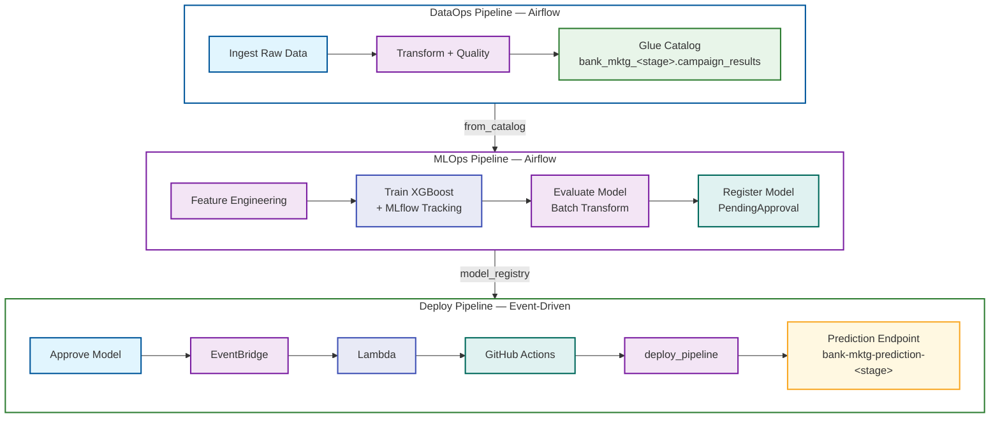
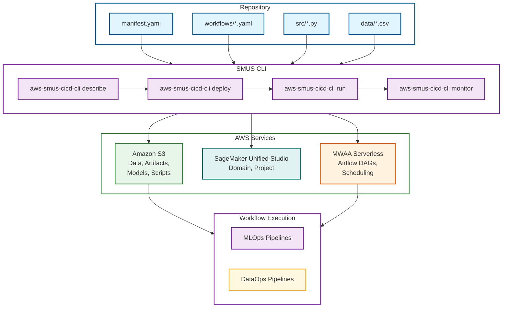

# Unified AI Operations: MLOps and DataOps with SMUS CLI

## Overview

This project provides a framework for deploying end-to-end data and ML pipelines to Amazon SageMaker Unified Studio using the [`aws-smus-cicd-cli`](https://github.com/aws/CICD-for-SageMakerUnifiedStudio). One manifest format. One CLI. One CI/CD pattern — whether you're ingesting raw data with Glue ETL or training an XGBoost model with SageMaker.

It includes two production-ready example pipelines that form a data lineage chain:

- **DataOps** — ingests, transforms, and validates bank marketing data using Glue and Athena
- **MLOps** — trains, evaluates, and deploys an XGBoost binary classifier using SageMaker Airflow operators

Both pipelines follow the same declarative workflow: define resources in YAML, deploy with one command, orchestrate on MWAA Serverless, and promote across environments (dev → test → prod) without code changes.

## Architecture

The system consists of three pipelines that form a data lineage chain with event-driven deployment:



The coupling points:

- **DataOps → MLOps:** Glue Data Catalog. DataOps writes to `bank_mktg_<stage>.campaign_results`, MLOps reads from it.
- **MLOps → Deploy:** SageMaker Model Registry. Training registers models as `PendingManualApproval`. Every approval triggers deployment via EventBridge → Lambda → GitHub Actions → deploy_pipeline DAG.

Stage-prefixed names (`bank_mktg_dev`, `bank-mktg-prediction-dev`) ensure complete namespace isolation across environments.

#### Deploy trigger behavior

The EventBridge rule is intentionally permissive — it matches every `Model Package State Change` event where `ModelApprovalStatus=Approved`, and the Lambda decides whether to dispatch:

- **Every genuine approval triggers the pipeline exactly once**, whether the model is approved from the SageMaker console, the SMUS UI, or the API. The Lambda keys off `UpdatedModelPackageFields` (it dispatches when `ModelApprovalStatus` is among the changed fields), so it does not depend on `previousModelApprovalStatus`, which API- and UI-driven approvals omit.
- **No infinite loop.** After each deploy, the promote workflow stamps `CustomerMetadataProperties` on the model version, which re-emits an `Approved` event. Those re-emits change only `CustomerMetadataProperties`, so the Lambda skips them instead of kicking off another deploy.

### Deployment Flow



The SMUS CLI handles resource provisioning in dependency order, stage-specific configuration substitution, and the full deployment lifecycle. GitHub Actions automates this across environments using OIDC authentication with two-hop role assumption (no long-lived credentials).

## Prerequisites

| Tool | Version | Purpose |
| ---- | ------- | ------- |
| Python | 3.11+ | Runtime for CLI and Glue scripts |
| AWS CLI | v2 | AWS resource management |
| `aws-smus-cicd-cli` | latest | Pipeline deployment and orchestration |
| `jq` | any | JSON parsing for shell scripts |

You also need:

- An AWS account with permissions for SageMaker, Glue, Athena, S3, IAM, and MWAA
- A SageMaker Unified Studio domain and project with MWAA Serverless enabled
- Environment variables configured for your target environment

```bash
pip install aws-smus-cicd-cli

export AWS_ACCOUNT_ID=<your-account-id>
export DEV_DOMAIN_NAME=<your-domain-name>
export DEV_REGION=<your-region>
export DEV_PROJECT_NAME=<your-project-name>
export PROJECT_ROLE=<your-login-role-name>
```

Each pipeline has its own README with detailed walkthroughs: [`examples/dataops-pipeline/README.md`](examples/dataops-pipeline/README.md) and [`examples/mlops-pipeline/README.md`](examples/mlops-pipeline/README.md).

## Quick Start

```bash
# Deploy and run the DataOps pipeline
cd examples/dataops-pipeline
aws-smus-cicd-cli describe --manifest manifest.yaml --targets dev --connect
aws-smus-cicd-cli deploy --manifest manifest.yaml --targets dev
aws-smus-cicd-cli run --manifest manifest.yaml --targets dev --workflow data_pipeline
aws-smus-cicd-cli monitor --manifest manifest.yaml --targets dev --live
```

## Pipelines

| Pipeline | Directory | Description |
| -------- | --------- | ----------- |
| **DataOps** | [`examples/dataops-pipeline/`](examples/dataops-pipeline/) | Glue ETL + Athena catalog registration |
| **MLOps Training** | [`examples/mlops-pipeline/`](examples/mlops-pipeline/) | Feature engineering, SageMaker training, evaluation, model registry |
| **Deploy (Event-Driven)** | [`examples/mlops-pipeline/workflows/deploy_pipeline.yaml`](examples/mlops-pipeline/workflows/deploy_pipeline.yaml) | EventBridge → Lambda → GitHub Actions → deploy_pipeline DAG → endpoint |

The MLOps pipeline depends on DataOps — run DataOps first to create the `campaign_results` table.

## Infrastructure

| File | Purpose |
| ---- | ------- |
| [`scripts/setup-mlops-infra.sh`](scripts/setup-mlops-infra.sh) | Event-driven deploy trigger (Lambda + EventBridge rule + IAM role) |
| [`scripts/setup-github-oidc.sh`](scripts/setup-github-oidc.sh) | GitHub OIDC provider + IAM role for CI/CD |
| [`scripts/load_env.py`](scripts/load_env.py) | Load environment config from YAML as exports |

### Setting up the event-driven deploy trigger

`setup-mlops-infra.sh` provisions the approval → deploy trigger (Lambda + EventBridge rule + IAM role) that fires the promote pipeline whenever a model is approved in the registry.

**1. Store a GitHub personal access token in Secrets Manager.** The Lambda reads this token to send a `repository_dispatch` event to GitHub Actions. The token needs `repo` scope (or `contents: write` for a fine-grained token on the target repo).

```bash
aws secretsmanager create-secret \
  --name bank-mktg/github-token \
  --secret-string 'ghp_your_token_here'
```

**2. Point the trigger at your GitHub repository.** The Lambda dispatches to the repo named in the `GITHUB_REPO` environment variable (`owner/repo` format). Export it before running the setup script:

```bash
export GITHUB_REPO=<owner>/<repo>
```

**3. Run the setup script** for the target environment. Arguments are `<dev|test|prod> <account-id> <region> <project-name>`:

```bash
cd examples/end-to-end-data-ml-pipeline
./scripts/setup-mlops-infra.sh dev "$AWS_ACCOUNT_ID" "$DEV_REGION" "$DEV_PROJECT_NAME"
```

The script is idempotent — re-running it updates the existing Lambda code and configuration. **Re-run it after any change to the trigger logic** (it calls `update-function-code`), since the deployed Lambda does not update automatically.

Once provisioned, the rule is `ENABLED` immediately. Approving a model version in `bank-mktg-prediction-models` then triggers the dev → test → prod promote cascade through GitHub Actions. See [Deploy trigger behavior](#deploy-trigger-behavior) for how the trigger handles approvals and avoids re-deploy loops.

## CI/CD

GitHub Actions workflows (at the repository root) automate multi-account deployment for this example:

| Workflow | File | Purpose |
| -------- | ---- | ------- |
| DataOps | [`e2e-dataops-pipeline.yml`](../../.github/workflows/e2e-dataops-pipeline.yml) | Deploy and run the data pipeline |
| MLOps Training | [`e2e-mlops-pipeline.yml`](../../.github/workflows/e2e-mlops-pipeline.yml) | Deploy training pipeline + provision MLOps infra (dev) |
| MLOps Promote | [`e2e-mlops-promote.yml`](../../.github/workflows/e2e-mlops-promote.yml) | Event-driven dev → test → prod promote cascade on model approval |
| MLOps Deploy | [`e2e-mlops-deploy.yml`](../../.github/workflows/e2e-mlops-deploy.yml) | Deploy the model endpoint for a stage |
| Reusable Deploy | [`smus-e2e-direct-deploy.yml`](../../.github/workflows/smus-e2e-direct-deploy.yml) | Shared deploy workflow used by the pipelines above |

CI/CD uses OIDC authentication with two-hop role assumption (no long-lived credentials). The MLOps training workflow provisions the EventBridge + Lambda deploy trigger in dev only — model approval happens in dev's registry and drives the promote cascade across stages.

## Documentation

| Document | Description |
| -------- | ----------- |
| [DataOps pipeline README](examples/dataops-pipeline/README.md) | Glue ETL + Athena catalog walkthrough |
| [MLOps pipeline README](examples/mlops-pipeline/README.md) | Training, evaluation, model registry, and event-driven deploy |

## Project Structure

```text
├── examples/
│   ├── dataops-pipeline/              # DataOps: Glue ETL + Athena
│   │   ├── manifest.yaml
│   │   ├── configs/dataops.yaml
│   │   ├── data/bank-mktg-sample.csv
│   │   ├── workflows/data_pipeline.yaml
│   │   └── src/
│   │       ├── glue-jobs/*.py
│   │       └── notebooks/validate_dataops.ipynb
│   └── mlops-pipeline/                # MLOps: SageMaker + MLflow
│       ├── manifest.yaml
│       ├── configs/mlops.yaml
│       ├── data/bank-mktg-sample.csv
│       ├── workflows/
│       │   ├── training_pipeline.yaml
│       │   └── deploy_pipeline.yaml
│       └── src/
│           ├── train_xgboost.py
│           ├── feature_engineering.py
│           ├── evaluate_model.py
│           ├── deploy_model.py
│           ├── requirements.txt
│           └── notebooks/
│               ├── evaluate_model.ipynb
│               └── validate_mlops.ipynb
└── scripts/                           # Setup and helper scripts
    ├── setup-mlops-infra.sh           # EventBridge + Lambda deploy trigger
    ├── setup-github-oidc.sh           # GitHub OIDC provider + IAM role
    ├── build-mlops-sourcedir.sh       # Build training sourcedir.tar.gz
    ├── mlops_helper.py                # Deploy status / smoke-test helpers
    ├── load_env.py                    # Load environment config from YAML
    └── test-deploy-trigger-event.json # Sample EventBridge event for testing
```

CI/CD workflows live at the repository root under [`.github/workflows/`](../../.github/workflows/) (see [CI/CD](#cicd)).
