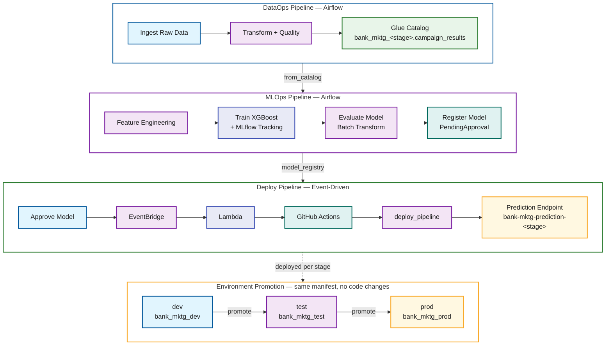

# Unified AI Operations: MLOps and DataOps with SMUS CLI

## Overview

This project provides a framework for deploying end-to-end data and ML pipelines to Amazon SageMaker Unified Studio using the [`aws-smus-cicd-cli`](https://github.com/aws/CICD-for-SageMakerUnifiedStudio). One manifest format. One CLI. One CI/CD pattern — whether you're ingesting raw data with Glue ETL or training an XGBoost model with SageMaker.

It includes two production-ready example pipelines that form a data lineage chain:

- **DataOps** — ingests, transforms, and validates bank marketing data using Glue and Athena
- **MLOps** — trains, evaluates, and deploys an XGBoost binary classifier using SageMaker Airflow operators

Both pipelines follow the same declarative workflow: define resources in YAML, deploy with one command, orchestrate on MWAA Serverless, and promote across environments (dev → test → prod) without code changes.

## Prerequisites

| Tool | Version | Purpose |
| ---- | ------- | ------- |
| Python | 3.11+ | Runtime for CLI and Glue scripts |
| AWS CLI | v2 | AWS resource management |
| `aws-smus-cicd-cli` | latest | Pipeline deployment and orchestration |
| `jq` | any | JSON parsing for shell scripts |

You also need:

- An AWS account with permissions for SageMaker, Glue, Athena, S3, IAM, and MWAA
- A SageMaker Unified Studio domain and project with MWAA Serverless enabled
- Environment variables set for every stage the manifest defines

These environment variables are the same values configured as GitHub repo/environment variables for CI (the source of truth). Set them in your shell for local runs:

```bash
pip install aws-smus-cicd-cli

# Account ID is resolved automatically from your AWS credentials
# (aws sts get-caller-identity), so you do NOT need to export AWS_ACCOUNT_ID.
# The domain is resolved by region + the `purpose` tag on the manifest's
# domain block (default: smus-cicd-testing), so a domain NAME is not needed.

# DataOps example (dev stage only):
export DEV_DOMAIN_REGION=<your-region>
export DEV_PROJECT_NAME=<your-dev-project>

# MLOps example also validates test/prod, so additionally set:
export TEST_DOMAIN_REGION=<your-region>
export TEST_PROJECT_NAME=<your-test-project>
export PROD_DOMAIN_REGION=<your-region>
export PROD_PROJECT_NAME=<your-prod-project>
export MLFLOW_TRACKING_SERVER_NAME=<your-mlflow-server-name>

# Optional: override the domain tag used for resolution (defaults to
# smus-cicd-testing for every stage in these examples).
# export DOMAIN_TAG_PURPOSE=<your-domain-purpose-tag>
```

Each pipeline has its own README with detailed walkthroughs: [`examples/dataops-pipeline/README.md`](examples/dataops-pipeline/README.md) and [`examples/mlops-pipeline/README.md`](examples/mlops-pipeline/README.md).

## CLI Commands

The `aws-smus-cicd-cli` provides the following commands for managing the pipeline lifecycle. See the [CLI Commands Reference](../../docs/cli-commands.md) for full options and examples.

| Command | Purpose |
| ------- | ------- |
| `create` | Create a new bundle manifest |
| `describe` | Validate and show bundle configuration (use `--connect` to pull live AWS info) |
| `bundle` | Package workflow and storage files from a source environment |
| `deploy` | Deploy a bundle to a target environment (auto-initializes if needed) |
| `run` | Trigger a workflow or run an Airflow CLI command |
| `logs` | Fetch workflow logs from CloudWatch |
| `monitor` | Monitor workflow status (use `--live` to poll until complete) |
| `test` | Run tests for pipeline targets |
| `integrate` | Integrate with external tools (e.g. Q CLI MCP server) |
| `destroy` | Delete all resources deployed by the manifest |

## Quick Start

```bash
# Deploy and run the DataOps pipeline
cd examples/dataops-pipeline
aws-smus-cicd-cli describe --manifest manifest.yaml --targets dev --connect
aws-smus-cicd-cli deploy --manifest manifest.yaml --targets dev
aws-smus-cicd-cli run --manifest manifest.yaml --targets dev --workflow data_pipeline
aws-smus-cicd-cli monitor --manifest manifest.yaml --targets dev --live
```

## How the SMUS CLI Deploys


The SMUS CLI handles resource provisioning in dependency order, stage-specific configuration substitution, and the full deployment lifecycle. GitHub Actions automates this across environments using OIDC authentication (no long-lived credentials) — each workflow assumes a per-stage OIDC role directly (single-hop).

## Architecture

The system consists of three pipelines that form a data lineage chain with event-driven deployment:



The coupling points:

- **DataOps → MLOps:** Glue Data Catalog. DataOps writes to `bank_mktg_<stage>.campaign_results`, MLOps reads from it.
- **MLOps → Deploy:** SageMaker Model Registry. Training registers models as `PendingManualApproval`. Every approval triggers deployment via EventBridge → Lambda → GitHub Actions → deploy_pipeline DAG.

Stage-prefixed names (`bank_mktg_dev`, `bank-mktg-prediction-dev`) ensure complete namespace isolation across environments.

### Deploy trigger behavior

The EventBridge rule is intentionally permissive — it matches every `Model Package State Change` event where `ModelApprovalStatus=Approved`, and the Lambda decides whether to dispatch:

- **Every genuine approval triggers the pipeline exactly once**, whether the model is approved from the SageMaker console, the SMUS UI, or the API. The Lambda keys off `UpdatedModelPackageFields` (it dispatches when `ModelApprovalStatus` is among the changed fields), so it does not depend on `previousModelApprovalStatus`, which API- and UI-driven approvals omit.
- **No infinite loop.** After each deploy, the promote workflow stamps `CustomerMetadataProperties` on the model version, which re-emits an `Approved` event. Those re-emits change only `CustomerMetadataProperties`, so the Lambda skips them instead of kicking off another deploy.

## Pipelines

| Pipeline | Directory | Description |
| -------- | --------- | ----------- |
| **DataOps** | [`examples/dataops-pipeline/`](examples/dataops-pipeline/) | Glue ETL + Athena catalog registration |
| **MLOps Training** | [`examples/mlops-pipeline/`](examples/mlops-pipeline/) | Feature engineering, SageMaker training, evaluation, model registry |
| **Deploy (Event-Driven)** | [`examples/mlops-pipeline/workflows/deploy_pipeline.yaml`](examples/mlops-pipeline/workflows/deploy_pipeline.yaml) | EventBridge → Lambda → GitHub Actions → deploy_pipeline DAG → endpoint |

The MLOps pipeline depends on DataOps — run DataOps first to create the `campaign_results` table.

## Infrastructure

| File | Purpose |
| ---- | ------- |
| [`scripts/setup-mlops-infra.sh`](scripts/setup-mlops-infra.sh) | Event-driven deploy trigger (Lambda + EventBridge rule + IAM role) |
| [`scripts/setup-github-oidc.sh`](scripts/setup-github-oidc.sh) | GitHub OIDC provider + IAM role for CI/CD |
| [`scripts/grant-datazone-access.sh`](scripts/grant-datazone-access.sh) | Grant the deploy role domain-wide DataZone access (fixes `ListConnections` AccessDenied) |

### Setting up the event-driven deploy trigger

`setup-mlops-infra.sh` provisions the approval → deploy trigger (Lambda + EventBridge rule + IAM role) that fires the promote pipeline whenever a model is approved in the registry.

> **In CI/CD this script runs automatically.** The MLOps training workflow ([`e2e-mlops-pipeline.yml`](../../.github/workflows/e2e-mlops-pipeline.yml)) passes `setup_infra: true` for the `dev` environment, and the reusable deploy workflow's "Provision MLOps infra" step runs `setup-mlops-infra.sh` before deploying. In CI, `GITHUB_REPO` defaults to the current repository, so only the Secrets Manager token (step 1) must exist beforehand. The manual steps below are for provisioning the trigger outside CI.

**1. Store a GitHub personal access token in Secrets Manager** (required for both CI and manual setup). The Lambda reads this token to send a `repository_dispatch` event to GitHub Actions. The token needs `repo` scope (or `contents: write` for a fine-grained token on the target repo).

```bash
aws secretsmanager create-secret \
  --name bank-mktg/github-token \
  --secret-string 'ghp_your_token_here'
```

**2. Point the trigger at your GitHub repository.** The Lambda dispatches to the repo named in the `GITHUB_REPO` environment variable (`owner/repo` format). Export it before running the setup script:

```bash
export GITHUB_REPO=<owner>/<repo>
```

**3. Run the setup script** for the target environment. Arguments are `<dev|test|prod> <account-id> <region> <project-name>`:

```bash
cd examples/end-to-end-data-ml-pipeline
./scripts/setup-mlops-infra.sh dev "$AWS_ACCOUNT_ID" "$DEV_DOMAIN_REGION" "$DEV_PROJECT_NAME"
```

The script is idempotent — re-running it updates the existing Lambda code and configuration. **Re-run it after any change to the trigger logic** (it calls `update-function-code`), since the deployed Lambda does not update automatically. In CI this happens on every MLOps training run.

### Troubleshooting: `ListConnections` AccessDenied during deploy

When deploying to a stage other than `dev` (e.g. `test` or `prod`), the deploy step may fail with:

```text
AccessDeniedException when calling ListConnections:
User is not permitted to perform operation: ListConnections.
❌ No S3 URI found for connection unknown (type: unknown)
❌ Storage item 1: Failed
📊 Total files deployed: 0
❌ Error: Deployment failed due to errors during bundle deployment
```

**Cause.** `ListConnections` is a project-scoped DataZone operation: the calling role must be a **member of the target project** to list its connections. The deploy role is a member of `dev-marketing` (so `dev` works), but a newly created `test-marketing` / `prod-marketing` project has no such membership, so DataZone denies `ListConnections` there. The deploy role typically lacks `datazone:CreateProjectMembership`, so the pipeline **cannot self-heal** — an admin has to establish the membership once. Because the connection can't be listed, the CLI can't resolve `default.s3_shared`'s `s3Uri` and 0 files are uploaded.

> Note: the manifests do **not** declare a `project.owners` entry — the deploying principal is the project owner when it *creates* the project, but for a project created out of band it must be added as a member/owner (this is why `dev` already works). Adding a role under `owners` would not help anyway, since the deploy role usually lacks `datazone:CreateProjectMembership`.

**Identify the actual deploy role first.** The role that makes the call is whatever the stage's OIDC role secret (`AWS_ROLE_ARN_DEV` / `AWS_ROLE_ARN_TEST` / `AWS_ROLE_ARN_PROD`) resolves to. Read it from any job's identity output (the workflow logs `aws sts get-caller-identity`): `arn:aws:sts::<account>:assumed-role/GitHubActionsRole-dev/...` means the runtime role is `GitHubActionsRole-dev`. Fix **that** role.

**Primary fix — add the runtime role as a project member/owner** (requires admin/project-owner credentials, since the deploy role can't add itself). Easiest via the DataZone console: open the target project (e.g. `test-marketing`) → **Members** → **Add members** → add the runtime role ARN as **Owner**, mirroring how it's already set on `dev-marketing`. Do the same for `prod-marketing` before deploying prod. CLI equivalent:

```bash
DOMAIN=<dzd-...>            # from deploy logs: domain_id=dzd-...
PROJECT=<target-project-id> # from deploy logs: project_id=...

# DataZone represents an IAM role as a group profile; find its id by role name
aws datazone search-group-profiles --domain-identifier "$DOMAIN" \
  --group-type DATAZONE_SSO_GROUP --search-text "GitHubActionsRole-dev" \
  --query 'items[].{id:id,name:groupName}' --output table

aws datazone create-project-membership --domain-identifier "$DOMAIN" \
  --project-identifier "$PROJECT" --designation PROJECT_OWNER \
  --member groupIdentifier=<GROUP_PROFILE_ID>
```

**Complementary fix — DataZone IAM (`ListConnections`) permission.** Membership is necessary but the role also needs `datazone:ListConnections`/`GetConnection` in IAM. If the role's DataZone IAM is project-scoped, grant it at the domain level with the helper (additive, least-privilege, `domain/*` wildcard so connection sub-resource ARNs like `…:domain/<domainId>/connection/<id>` match):

```bash
cd examples/end-to-end-data-ml-pipeline
# Args: <role-name> <account-id> <region> <domain-id>  (use the runtime role)
./scripts/grant-datazone-access.sh \
  GitHubActionsRole-dev "$AWS_ACCOUNT_ID" "$DOMAIN_REGION" "$DOMAIN_ID"

# verify
aws iam get-role-policy --role-name GitHubActionsRole-dev \
  --policy-name SmusDataZoneDomainDeployAccess
```

After the runtime role is a member of the target project (and has the IAM above), re-trigger the deploy — `ListConnections` resolves `default.s3_shared` and the storage items upload.

Once provisioned, the rule is `ENABLED` immediately. Approving a model version in `bank-mktg-prediction-models` then triggers the dev → test → prod promote cascade through GitHub Actions. See [Deploy trigger behavior](#deploy-trigger-behavior) for how the trigger handles approvals and avoids re-deploy loops.

## CI/CD

GitHub Actions workflows (at the repository root) automate multi-account deployment for this example:

| Workflow | File | Purpose |
| -------- | ---- | ------- |
| DataOps | [`e2e-dataops-pipeline.yml`](../../.github/workflows/e2e-dataops-pipeline.yml) | Deploy and run the data pipeline |
| MLOps Training | [`e2e-mlops-pipeline.yml`](../../.github/workflows/e2e-mlops-pipeline.yml) | Deploy training pipeline + provision MLOps infra (dev) |
| MLOps Promote | [`e2e-mlops-promote.yml`](../../.github/workflows/e2e-mlops-promote.yml) | Event-driven dev → test → prod promote cascade on model approval |

CI/CD uses OIDC authentication (no long-lived credentials). Each workflow assumes its per-stage OIDC role (`AWS_ROLE_ARN_DEV`/`_TEST`/`_PROD`) directly — single-hop, no separate deployment role. The MLOps training workflow provisions the EventBridge + Lambda deploy trigger in dev only — model approval happens in dev's registry and drives the promote cascade across stages.

The promote workflow's stage gates (`approve-test`, `approve-prod`) use the [`trstringer/manual-approval`](https://github.com/trstringer/manual-approval) action, which opens a tracking **issue** and waits for a listed approver to comment `approved` (or `approve`/`lgtm`/`yes`). This requires **Issues enabled** on the repository and the workflow's `issues: write` permission. Approvers come from the `MLOPS_APPROVERS` variable (comma/newline-separated usernames); if unset it falls back to a single default approver.

### GitHub configuration (CI source of truth)

The workflows read their configuration from GitHub Actions **variables** and **secrets** — there is no config file checked into the repo. In these examples all jobs run in a single GitHub Environment named `test-aws-account`, so the per-stage OIDC role secrets and the `DOMAIN_REGION` variable live there.

Some values that used to be configured are now derived at runtime and no longer need to be set:

- **`AWS_ACCOUNT_ID`** — resolved via `aws sts get-caller-identity`.
- **Domain** — resolved by region + the `purpose` tag on the manifest's domain block (default `smus-cicd-testing`), so no domain *name* variable is needed.
- **Project owner** — the deploying principal is already the project owner, so the manifests no longer hardcode an owner role.

**Secrets** (stored in the `test-aws-account` environment):

| Secret | Purpose |
| ------ | ------- |
| `AWS_ROLE_ARN_DEV` / `AWS_ROLE_ARN_TEST` / `AWS_ROLE_ARN_PROD` | Per-stage OIDC roles assumed by the workflows (dev → DEV, test → TEST, prod → PROD) |

**Variables:**

| Variable | Scope | Purpose |
| -------- | ----- | ------- |
| `DOMAIN_REGION` | environment (`test-aws-account`) | Region for all stages (feeds `*_DOMAIN_REGION`) |
| `DEV_PROJECT_NAME` / `TEST_PROJECT_NAME` / `PROD_PROJECT_NAME` | repo | SMUS project per stage (optional; manifest and workflows default to `dev/test/prod-marketing`) |
| `MLOPS_APPROVERS` | repo | Promote-gate approver list, comma/newline-separated (promote workflow; requires Issues enabled) |
| `MLFLOW_TRACKING_SERVER_NAME` | repo/environment | MLflow tracking server name (optional; manifest has a default) |
| `DOMAIN_TAG_PURPOSE` | repo/environment | Optional override for the domain `purpose` tag (defaults to `smus-cicd-testing`) |

For local runs, export the equivalent values in your shell (see [Prerequisites](#prerequisites)).

## Documentation

| Document | Description |
| -------- | ----------- |
| [DataOps pipeline README](examples/dataops-pipeline/README.md) | Glue ETL + Athena catalog walkthrough |
| [MLOps pipeline README](examples/mlops-pipeline/README.md) | Training, evaluation, model registry, and event-driven deploy |

## Project Structure

```text
├── examples/
│   ├── dataops-pipeline/              # DataOps: Glue ETL + Athena
│   │   ├── manifest.yaml
│   │   ├── data/bank-mktg-sample.csv
│   │   ├── workflows/data_pipeline.yaml
│   │   └── src/
│   │       ├── glue-jobs/*.py
│   │       └── notebooks/validate_dataops.ipynb
│   └── mlops-pipeline/                # MLOps: SageMaker + MLflow
│       ├── manifest.yaml
│       ├── workflows/
│       │   ├── training_pipeline.yaml
│       │   └── deploy_pipeline.yaml
│       └── src/
│           ├── train_xgboost.py
│           ├── feature_engineering.py
│           ├── evaluate_model.py
│           ├── deploy_model.py
│           ├── requirements.txt
│           └── notebooks/
│               ├── evaluate_model.ipynb
│               └── validate_mlops.ipynb
└── scripts/                           # Setup and helper scripts
    ├── setup-mlops-infra.sh           # EventBridge + Lambda deploy trigger
    ├── setup-github-oidc.sh           # GitHub OIDC provider + IAM role
    ├── grant-datazone-access.sh       # Grant deploy role domain-wide DataZone access
    ├── build-mlops-sourcedir.sh       # Build training sourcedir.tar.gz
    ├── mlops_helper.py                # Deploy status / smoke-test helpers
    └── test-deploy-trigger-event.json # Sample EventBridge event for testing
```

CI/CD workflows live at the repository root under [`.github/workflows/`](../../.github/workflows/) (see [CI/CD](#cicd)).
